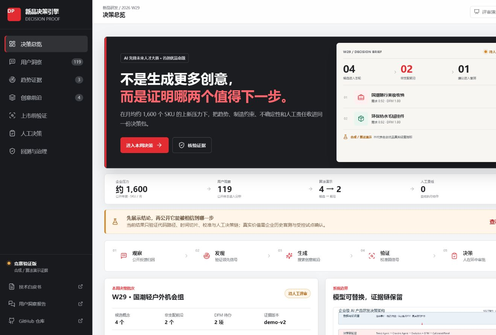
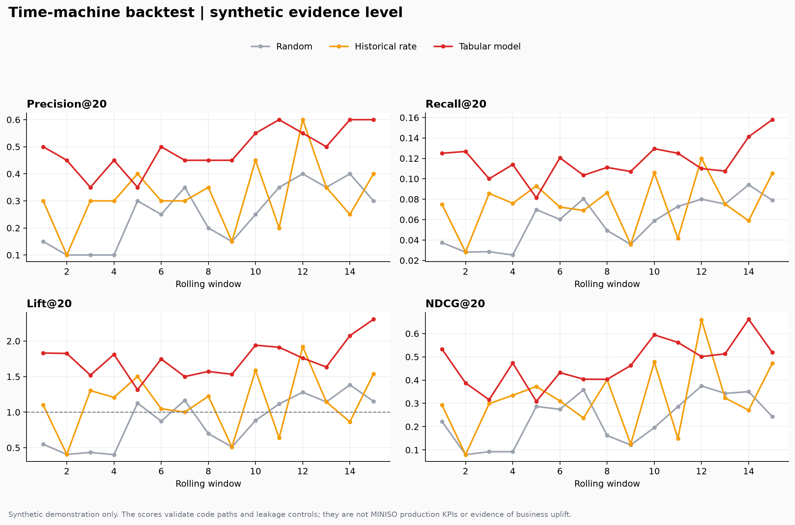
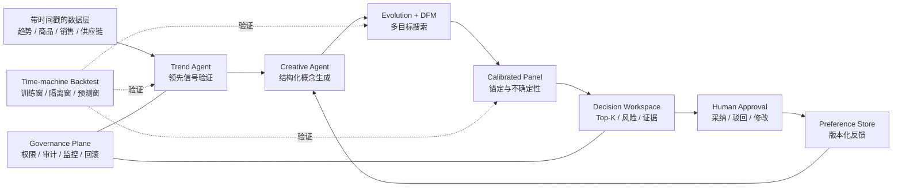

# MINISO AI Product Decision Engine

**面向新品研发的可回测、可校准、人在环中的 AI 决策引擎**
AI 先锋未来人才大赛 · 三人学生团队 · 面向企业真实业务问题 · 竞赛评审版 v0.2.4

<p align="center">
  <a href="https://lifelonglearneradam.github.io/miniso-ai-decision-engine/"></a>
  <a href="docs/00_评委快速指南.md"></a>
  <a href="docs/00_用户真实反馈洞察/report/miniso_user_insight_report_zh.md"></a>
</p>

<p align="center"><strong>点击下图进入公网演示：公开用户洞察 → 趋势证据 → 创意前沿 → 上市前验证 → 人工决策 → 回测与治理</strong></p>

<p align="center">
  <a href="https://lifelonglearneradam.github.io/miniso-ai-decision-engine/"></a>
</p>

[](https://github.com/lifelonglearnerAdam/miniso-ai-decision-engine/actions/workflows/ci.yml)
[](https://www.python.org/)
[](LICENSE)
[](artifacts/demo/metrics.json)

> **评审演示入口**：[打开公网新品决策工作台](https://lifelonglearneradam.github.io/miniso-ai-decision-engine/) · 用户洞察 → 趋势证据 → 创意前沿 → 上市前验证 → 人工决策 → 回测与治理

> **评审对象**：本页面面向赛事评委、赛题企业代表，以及业务、技术、安全与治理评审人员。内容按“企业问题—解决机制—可核验证据—联合验证路径”组织；命令行和代码目录仅用于技术复核，不是本方案的主要叙事。

> **证据声明**：仓库内回测使用可重复生成的合成数据，只验证代码路径、时间切片和防泄漏控制。它不是名创优品生产数据，不构成真实爆品命中率、收入提升或 ROI 证明。企业效果必须通过脱敏历史数据回放与前瞻试点确认。

## 提交方与项目定位

本项目由**三名学生组成的参赛团队**独立完成，并向赛事评委与赛题企业提交一套新品研发决策支持方案。方案聚焦高速上新中的趋势判断、创意筛选、上市前验证、决策审批和经验沉淀，按企业工作流、数据约束与治理门槛设计。当前交付属于竞赛验证版，不代表企业内部项目或生产部署；是否具备业务价值，应由企业数据盲测、影子运行和受控试点决定。

## 评审导航

| 评审角色 / 时间 | 建议查看 | 主要回答的问题 |
|---:|---|---|
| 综合评审 / 3 分钟 | [在线工作台](https://lifelonglearneradam.github.io/miniso-ai-decision-engine/) + [评委快速指南](docs/00_评委快速指南.md) | 企业问题、方案差异和证据边界 |
| 用户与产品评审 / 6 分钟 | [公开用户洞察](docs/00_用户真实反馈洞察/report/miniso_user_insight_report_zh.md) | 用户问题如何转译为产品字段和验证动作 |
| 业务评审 / 8 分钟 | [行业分析](docs/01_行业分析报告/README.md) + [企业试点路径](docs/02_技术白皮书/AI产品开发引擎技术白皮书.md#12-企业试点与验收) | 业务价值如何验证、如何控制试点风险 |
| 技术评审 / 20 分钟 | 技术白皮书：[Word](output/docx/AI产品开发引擎技术白皮书.docx) · [PDF](output/pdf/AI产品开发引擎技术白皮书.pdf) · [Markdown](docs/02_技术白皮书/AI产品开发引擎技术白皮书.md) | 架构、算法、数据、安全与工程证据 |
| 深度核验 | [机器可读结果](artifacts/demo/metrics.json) + [测试](tests/) + [CI](.github/workflows/ci.yml) + [安全治理](docs/07_安全治理与生产化.md) | 结果能否复现、边界是否可审计 |



## 企业问题与拟解决机制

名创优品 2025 年年报披露，MINISO 品牌平均每月上新约 1,600 个 SKU，并明确将持续创新、成功上新和及时响应消费者偏好列为关键经营能力与风险来源。[来源：MINISO 2025 Annual Report](https://ir.miniso.com/image/Annual+Report+2025+US.pdf)

| 企业决策问题 | 本方案的解决机制 | 当前证据与边界 |
|---|---|---|
| 多源趋势信号的领先性难以确认 | 统一时间语义，检验滞后方向、Granger 预测领先性并执行滚动回测 | 已完成合成验证；真实领先性需企业历史数据检验 |
| 创意筛选依赖个人经验且解释口径不一致 | 以结构化概念、多目标进化、DFM 和非支配前沿形成候选证据 | 算法与规则框架已实现；企业规则需领域专家共创 |
| 上市前研究容易输出缺少依据的精确分数 | 以真实观察锚定虚拟面板，并用保形区间表达不确定性 | 校准代码已实现；外部效度需真实消费者数据验证 |
| 采购、打样和上架决策缺少统一追溯链 | 输出候选、证据、风险和版本血缘，保留人工审批与回滚 | 审计设计已完成；生产身份和审批系统尚未接入 |
| 成功与失败经验难以沉淀为组织资产 | 记录采纳、驳回、修改及原因，形成可评估的偏好数据 | 已有接口与确定性权重更新；持续训练属于后续验证范围 |

本项目把新品研发从“一次性大模型生成”改造成一条可审计的决策链：

1. **发现**：用时间戳完整的趋势信号形成候选方向，并检验信号是否真正领先销量。
2. **生成**：多 Agent 生成结构化概念，进化搜索同时保留需求潜力、可制造性和新颖性。
3. **验证**：用真实观察锚定虚拟面板评分，以保形区间表达不确定性。
4. **决策**：输出 Top-K 候选、风险和证据，最终采纳/否决由产品经理审批。
5. **学习**：把采纳、驳回和修改沉淀为领域偏好数据，再进入受控迭代。

## 系统架构



## 可验证设计与企业验收口径

| 设计 | 与普通 Demo 的区别 | 当前证据 | 企业验收方式 |
|---|---|---|---|
| 时光机回测 | 固定训练窗 + 14 天隔离窗 + 90 天预测窗，显式移除未来结果列 | 合成数据、15 个窗口、逐窗审计日志 | 企业历史数据盲测 |
| 校准虚拟面板 | 训练/保形校准分离，输出区间而非假精确点估计 | 单元测试与离线模拟 | 与真实调研/销量对照，测 ECE 与覆盖率 |
| 进化式创意 | 返回真正的非支配前沿，不把综合分冒充“帕累托” | 可复现算法测试 | 专家盲评 + DFM 规则命中审计 |
| 领先信号验证 | 比较 `social[t-lag]` 与 `sales[t]`，并做 Granger 检验 | 合成领先 3 天信号测试 | 按品类的历史序列检验与漂移复核 |
| 偏好数据飞轮 | 基座模型可替换，企业偏好记录和版本化评估留在系统内 | 接口设计阶段 | 影子运行、冠军/挑战者评估、人工审批 |

## 企业联合验证路径

建议采用三阶段门控，避免将竞赛原型直接写入生产流程：

| 阶段 | 数据与动作 | 进入下一阶段的条件 |
|---|---|---|
| 历史盲测 | 使用脱敏历史商品、趋势、销量与成本数据；不连接生产系统 | 时间盲测优于已冻结业务基线，且无重大泄漏 |
| 影子运行 | 定期生成候选与证据包，仅供产品经理对照 | 稳定性、校准、解释可用性和治理控制达标 |
| 受控试点 | 限定品类与区域，审批后执行并支持回滚 | 业务 KPI、风险、安全与合规共同通过 |

任何模型输出都不直接触发打样、采购、定价或上架。高影响动作必须保留人工批准、理由和版本化审计记录。

## 技术复核附录（业务评审可跳过）

以下命令用于赛事技术评审复核实现与实验，不是面向企业使用者的产品操作手册。

### 1. 复核环境

```bash
python -m venv .venv
# Windows: .venv\Scripts\activate
# macOS/Linux: source .venv/bin/activate
python -m pip install -r requirements-dev.txt
```

### 2. 质量门禁

```bash
ruff check src scripts tests
pytest -q
```

### 3. 生成回测证据

```bash
python scripts/run_backtest.py
```

输出位于 `artifacts/demo/`：

- `metrics.json`：协议、数据血缘、逐窗口审计和全部指标；
- `backtest_summary.csv`：三种方法的平均指标；
- `backtest_metrics.png`：适合路演的对比图。

固定种子下的当前合成演示结果：

| 方法 | Precision@20 | Lift@20 | NDCG@20 |
|---|---:|---:|---:|
| 随机排序 | 0.250 | 0.875 | 0.232 |
| 历史品类命中率 | 0.317 | 1.133 | 0.320 |
| 可解释表格模型 | **0.490** | **1.752** | **0.471** |

这些结果证明实现能识别生成器中注入的可学习关系；不能外推为真实业务表现。

### 4. 端到端实现复核

```bash
python -m src.pipeline.run_all
```

LLM 服务是可选项。启动 Ollama 并按 `.env.example` 配置后，多 Agent 可调用本地模型；未启动时，离线算法与测试仍可独立运行。

## 回测协议的防泄漏约束

```text
训练窗 [T, T+179] → 隔离窗 14 天 → 预测窗 90 天 → 向前滚动 30 天
```

- 训练、隔离、预测区间互不重叠；
- 预测器只能看到决策时点可得字段；
- `is_hit`、`sales_90d`、`realized_margin` 在候选评分前被移除；
- 每个窗口记录起止日期、样本量、正例数和受保护列；
- 随机基线由产品 ID 稳定散列生成，结果可重复；
- 真实试点还需处理数据延迟、概念重复、SKU 族泄漏和多重检验。

## 技术证据目录

```text
src/                    核心算法与 Agent
tests/                  回测、校准、进化、数据与 Agent 测试
scripts/run_backtest.py 可复现实验入口
artifacts/demo/         版本化的合成演示证据
docs/                   评委指南、白皮书、安全与专题报告
output/                 正式 DOCX/PDF 交付件
.github/workflows/      持续集成质量门禁
```

## 提交状态与评审边界

- 已完成：防泄漏滚动回测、三基线对照、结构化 Agent、分割保形校准、显式 DFM 规则、真正的非支配前沿、测试与 CI。
- 演示级：合成数据、表格模型、离线 Agent fallback、偏好权重更新。
- 需企业数据：真实趋势领先性、虚拟面板外部效度、业务 uplift、成本收益和区域迁移能力。
- 生产前必需：身份与权限、数据分级、密钥管理、内容与 IP 审核、模型监控、红队测试、回滚和法律评估。

## 说明与许可

本仓库是独立竞赛项目，不代表名创优品官方产品或认可。MINISO/名创优品及相关商标归其权利人所有。代码以 [MIT License](LICENSE) 发布；数据、模型权重、第三方内容和 IP 素材仍受各自许可约束。
