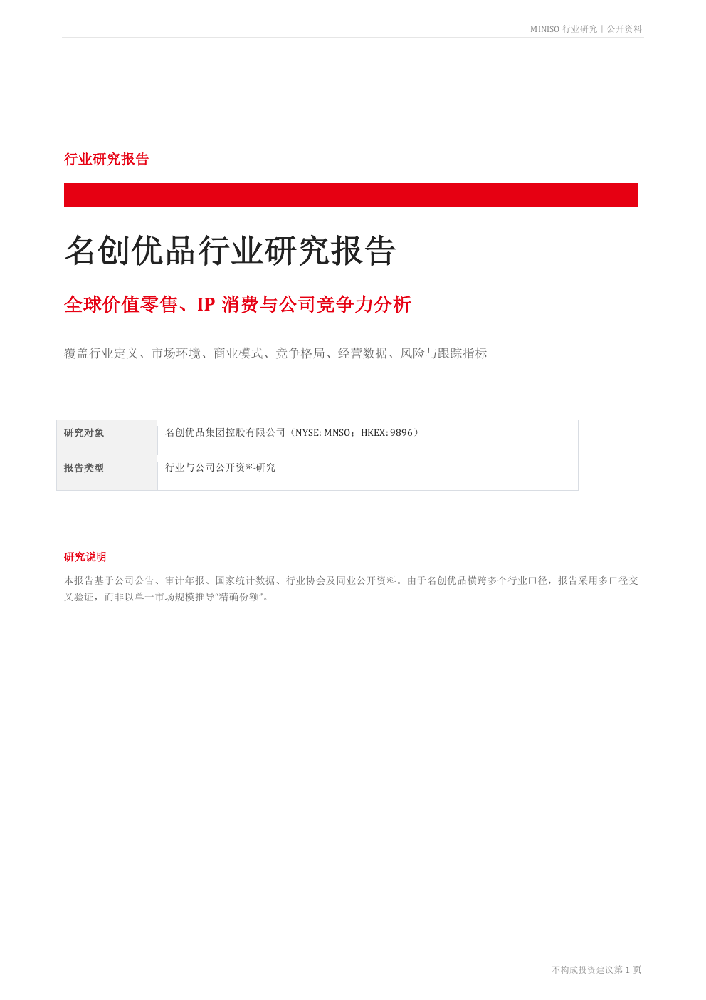
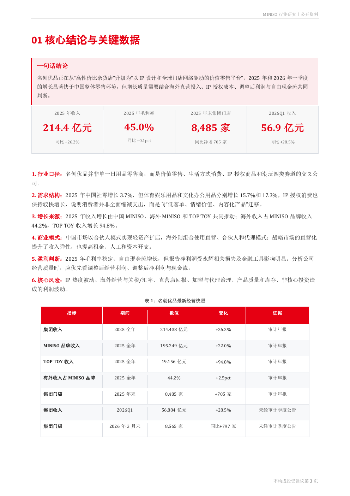
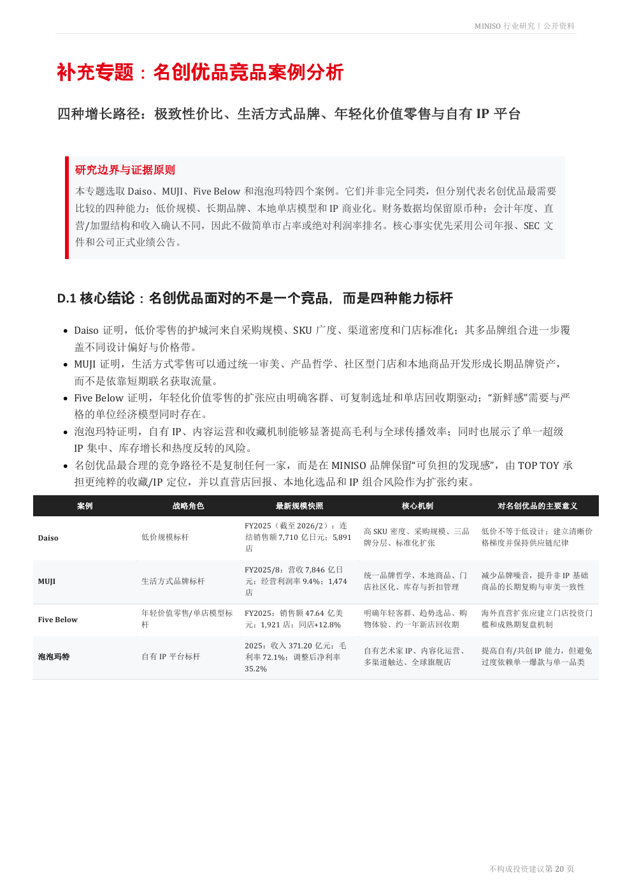

# 名创优品行业及竞品案例研究



本仓库收录一份基于公开资料整理的名创优品行业与公司研究报告，覆盖价值零售、IP 消费、商业模式、竞争格局、经营与财务表现、风险监测，以及 Daiso、MUJI、Five Below、泡泡玛特等竞品案例。

## 阅读入口

- [PDF 完整版](docs/miniso-industry-competitor-report.pdf)
- [Markdown 文本版](docs/report-text.md)
- [网页阅读页](index.html)

> PDF 保留原始图表和排版；Markdown 文本版便于 GitHub 搜索、引用和版本管理。

## 核心结论

名创优品正在从“高性价比杂货店”升级为“以 IP 设计和全球门店网络驱动的价值零售平台”。报告认为，评估其增长质量时，需要同时观察海外直营投入、IP 授权成本、调整后利润、自由现金流和单店回报。

## 关键数据

| 指标 | 数值 | 变化 |
|---|---:|---:|
| 2025 年集团收入 | 214.4 亿元 | 同比 +26.2% |
| 2025 年毛利率 | 45.0% | 同比 +0.1pct |
| 2025 年末集团门店 | 8,485 家 | 同比净增 705 家 |
| 2026Q1 收入 | 56.9 亿元 | 同比 +28.5% |
| 2025 年 TOP TOY 收入增速 | - | +94.8% |



## 报告结构

1. 核心结论与关键数据
2. 行业边界与研究方法
3. 市场环境：零售与 IP 消费
4. 产业链与商业模式
5. 竞争格局与成功要素
6. 名创优品业务与战略
7. 经营与财务表现
8. 竞争优势、SWOT 与风险
9. 展望、监测指标与结论
10. 来源、口径说明与竞品案例分析

## 竞品研究

报告选取四类能力标杆：

- **Daiso**：低价规模、SKU 广度与门店标准化
- **MUJI**：生活方式品牌、统一审美与长期品牌资产
- **Five Below**：年轻化价值零售与可复制单店模型
- **泡泡玛特**：自有 IP、内容运营与收藏生态



## 仓库结构

```text
.
├── README.md
├── UPLOAD_GUIDE.md
├── index.html
├── assets/
│   ├── cover.png
│   ├── key-findings.png
│   └── competitor-summary.png
└── docs/
    ├── miniso-industry-competitor-report.pdf
    └── report-text.md
```

## 使用与引用

- 在 GitHub 页面中直接点击 PDF 或 Markdown 文件即可阅读。
- 对外引用时，建议注明报告标题、版本日期及具体页码。
- 若计划公开仓库，请先确认你拥有报告内容及图片的公开发布权。

## 免责声明

本报告基于公开资料整理，仅用于研究、学习与作品集展示，不构成投资建议。原始数据口径、更新时间及引用来源以 PDF 报告中的说明为准。
