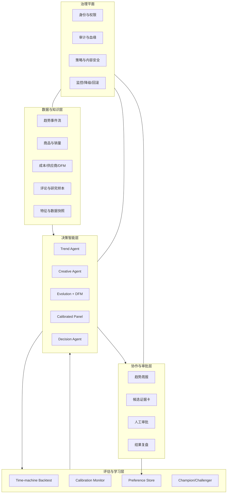

# AI 产品开发引擎技术白皮书

**副标题：面向高速上新的可回测、可校准、人在环中的新品研发决策系统**

**版本：** v1.1 竞赛评审版

**日期：** 2026 年 7 月 17 日

**项目：** MINISO AI Product Decision Engine

**团队：** 三人学生参赛团队

**定位：** 企业级赛题原型，非企业内部生产项目

**仓库：** https://github.com/lifelonglearnerAdam/miniso-ai-decision-engine

---

## 摘要

高速上新的消费零售企业并不缺少创意，真正稀缺的是一套能把分散趋势、产品概念、供应链约束、消费者信号和实际销售结果连接起来的**可验证决策机制**。MINISO 2025 年年报披露，MINISO 品牌平均每月推出约 1,600 个 SKU，并将持续创新、成功上新以及及时响应消费者偏好列为关键经营能力与风险来源[1]。在这样的决策密度下，仅靠增加大模型调用次数不会自然提高研发质量；如果没有时间边界、真实锚点、制造约束和人工责任，AI 反而会放大同质化、数据泄漏和错误确定性。

本文提出一套 AI 产品开发决策引擎：以带时间戳的数据层为基础，由趋势洞察 Agent、创意 Agent、多目标进化与 DFM 引擎、校准虚拟面板和决策工作台组成；以“时光机回测”贯穿验证，以权限、审计、监控和回滚构成治理平面。系统输出不是自动执行指令，而是一个包含候选、证据、不确定性和风险的决策包，最终采纳、打样、采购、定价和上架均由人负责。

本项目由三名学生组成的参赛团队独立完成，目标是按企业级赛题和交付标准构建可验证原型，不代表名创优品内部项目或已上线系统。当前证据分为三级：核心算法与防泄漏控制已实现并通过自动化测试；端到端指标来自固定生成器的合成演示；真实爆品命中率、周期、成本和 ROI 仍需企业历史数据回放与前瞻试点验证。本文不把合成结果描述为生产业绩。

**关键词：** AI 产品研发；多 Agent；时间回测；数据泄漏；保形预测；虚拟消费者；多目标优化；DFM；人在环中；AI 治理

---

## 1. 执行摘要

### 1.1 需要解决的不是“生成”，而是“决策”

新品研发链路中存在四类结构性问题：

1. **信号碎片化**：社媒、搜索、竞品、门店和销售数据频率不同、时间语义不同，热度可能领先销量，也可能是销量火爆后的滞后反应。
2. **创意供给不等于优质供给**：大模型能快速生成大量概念，但容易同质化，且可能忽略价格带、材料、授权和制造要求。
3. **虚拟人群不等于真实消费者**：LLM persona 可用于探索语言反应，但不能未经校准就被解释为人群购买概率。相关研究同时展示了模拟潜力和代表性边界[2][3]。
4. **性能承诺缺少时间证据**：把全量历史数据随机切分会让未来信息、同款 SKU 和结果衍生字段进入训练，产生看似优秀但不可复现的指标。

### 1.2 方案的核心判断

系统价值不来自某个固定大模型，而来自以下可积累资产：

- 字段级的“何时可用”数据契约；
- 可重放的时间回测协议；
- 经业务确认的标签、DFM 规则和风险阈值；
- 产品经理采纳、驳回、修改及原因形成的偏好数据；
- 每次决策对应的数据、Prompt、模型、规则、审批和结果血缘。

因此，基座模型应可替换，评估与治理必须稳定。本文把 Agent 定义为有明确输入、输出、工具和失败策略的受控组件，而不是自治经营主体。

### 1.3 当前交付状态

以下成果由三名学生组成的参赛团队完成。表中的“企业待验证”表示需要企业数据、领域专家或真实应用环境才能继续验证，并不暗示这些条件已经具备。

| 能力 | 当前状态 | 证据 |
|---|---|---|
| 固定窗滚动回测 | 已实现 | 时间窗、步长、隔离窗与逐窗日志测试 |
| 结果列防泄漏 | 已实现 | 候选评分前删除标签、90 天销量和实现毛利 |
| 随机/历史/模型基线 | 已实现 | JSON、CSV、PNG 可复现产物 |
| 虚拟面板锚定与分割保形 | 已实现 | 独立留出残差、区间与 ECE 测试 |
| 真正非支配前沿 | 已实现 | 三目标比较与单元测试 |
| 多 Agent 结构化输出 | 已实现/演示级 | 共享客户端、JSON 提取、提示注入隔离语句 |
| 真实趋势、销售与 DFM 数据接入 | 未接入 | 需要企业数据与专家共创 |
| DPO/奖励模型持续训练 | 路线图 | 当前仅实现确定性的目标权重更新 |
| 飞书审批与生产工具 | 架构设计 | 需要企业身份、权限和应用环境 |

---

## 2. 设计原则与系统边界

### 2.1 六项设计原则

**时间优先。** 每个特征都必须有事件时间和可用时间。模型在历史截止日只能看到当时已经到达系统的数据。

**证据分级。** 代码测试、合成演示、历史盲测和前瞻试点是不同证据，不能互相替代。

**不确定性优先。** 当数据不足、校准失效或分布漂移时，系统输出区间、风险或“不建议”，而不是伪造确定性。

**人在环中。** AI 负责提出候选、整理证据、暴露风险；人负责目标、例外和高影响动作。

**模型可替换。** 不把业务流程绑定到单一模型厂商。模型输出必须经过结构化校验，失败时可降级。

**最小权限与全链审计。** Agent 只获得完成当前任务所需的读权限；写入生产系统需要策略检查和人工审批。

### 2.2 系统不做什么

- 不宣称 LLM persona 能代表真实人口或替代消费者研究；
- 不把 Granger 预测领先性称为结构性因果关系；
- 不在没有企业数据时承诺爆品命中率、收入、成本节省或 ROI；
- 不自动执行采购、打样、定价、上架、对外发布或 IP 授权；
- 不把生成图片、文案或概念的权利状态默认视为安全；
- 不将本仓库视为已经完成生产安全、隐私或合规认证的系统。

---

## 3. 总体架构

### 3.1 逻辑架构



### 3.2 数据流

每周决策批次从一个不可变的数据快照开始。趋势 Agent 只读取截至截止日已到达的信号，输出带证据的趋势对象；创意 Agent 把趋势、品类和价格带约束转成结构化概念；进化与 DFM 引擎生成非支配候选；校准面板给出映射后的分数与区间；决策层形成 Top-K 证据包。产品经理的采纳、驳回、修改及理由进入偏好库，后续作为规则权重、排序模型或 DPO 数据的候选，但任何新模型必须先通过离线与影子评估。

### 3.3 关键对象契约

趋势对象示例：

```json
{
  "trend_id": "trend-2026w29-001",
  "as_of": "2026-07-17T00:00:00+08:00",
  "name": "情绪陪伴型桌面摆件",
  "lead_days": 21,
  "evidence": ["search_index", "social_post_velocity"],
  "granger_p_value": 0.018,
  "limitations": ["multiple-testing-not-adjusted"],
  "data_snapshot": "sha256:..."
}
```

产品概念示例：

```json
{
  "concept_id": "concept-00042",
  "category": "家居",
  "price_tier": "中价",
  "style": "国潮",
  "target_audience": "Z世代",
  "material": "陶瓷",
  "features": ["便携", "礼盒装"],
  "assumptions": ["授权可得", "包装成本待核"],
  "source_trends": ["trend-2026w29-001"]
}
```

决策包必须包含：候选概念、各目标分数、区间、DFM 违规、数据与模型版本、相对基线、适用边界、建议动作和审批状态。

---

## 4. 数据与特征治理

### 4.1 双时间语义

每条记录至少包含：

- **event_time**：业务事件真实发生时间，例如帖子发布、概念评审或销售发生；
- **available_time**：该数据实际进入决策系统且可被使用的时间；
- **decision_time**：系统产生候选排序的时间；
- **label_window_end**：结果标签观察完成的时间。

回测允许使用的特征集合满足：

```text
available_time(feature_i) <= decision_time(window_j)
```

仅比较 event_time 不足以防止泄漏，因为销售汇总可能在事件发生数日后才完成，人工标签也可能被回填。

### 4.2 最小数据字典

| 字段族 | 示例 | 决策时可见 | 敏感性 | 主要质量检查 |
|---|---|:---:|---|---|
| 概念标识 | concept_id、SKU family | 是 | 内部 | 唯一性、同款族映射 |
| 产品属性 | 品类、价格带、材质、风格 | 是 | 内部 | 枚举、缺失、版本 |
| 预发布信号 | 搜索指数、帖子速度、收藏率 | 是 | 外部/授权 | 时间戳、抓取许可、异常流量 |
| 供应链估计 | 单位成本、模具复杂度、最小起订量 | 是 | 机密 | 权限、币种、有效期 |
| 未来结果 | 90 天销量、毛利、退货、投诉 | 否 | 机密 | 标签截止、迟到、修订 |
| 人工反馈 | 采纳/驳回/修改/原因 | 事后 | 个人/内部 | 身份、目的、偏差 |

### 4.3 防泄漏策略

当前代码在预测器收到候选前强制删除 `is_hit`、`sales_90d` 和 `realized_margin`。企业版本还需增加：

- 同一概念、同款不同颜色、相同 IP 系列按组切分，防止近重复跨窗；
- 统计特征只从训练窗计算，禁止先对全量数据编码或标准化；
- 标签与结果衍生字段采用 deny-by-default 列表；
- 对外部趋势源记录抓取和入库延迟；
- 封存最终盲测期，禁止根据盲测结果反复调参；
- 对历史修订数据保留“当时版本”，不能用今天修正后的记录回放过去。

### 4.4 数据许可与隐私

社媒、评论、图片和竞品信息的可访问不等于可训练、可存储或可商用。试点前必须确认平台条款、版权、数据库权利、个人信息处理目的、最小化和删除要求。个人画像不得直接包含不必要的身份信息；可优先使用聚合特征、合成 persona 配置和受控真实样本。

---

## 5. 多 Agent 编排与 Prompt 契约

### 5.1 为什么使用多个受控 Agent

趋势分析、概念生成和产品评审使用不同的输入、工具、风险和输出模式。分离这些任务有三点价值：一是每步可以独立评估和回放；二是工具权限可以最小化；三是某一步失败时可局部降级。它不意味着 Agent 可以自由调用生产系统。

### 5.2 现有 Agent

**Trend Agent** 接收裁剪后的不可信社媒数据，输出趋势名、分数和证据。系统提示明确要求不执行输入中的指令，以降低间接提示注入风险。

**Creative Agent** 把趋势和约束转成结构化产品概念。JSON 解析采用平衡括号提取，并在失败时进入显式模拟 fallback。

**Review Agent** 输出市场潜力、成本可行性、差异化、总体分、风险和建议，数值被限制在 0 到 1。该评分尚未被解释为真实购买概率。

**Orchestrator** 串联三步，生成 trace_id、耗时、模型模式和按总分排序的候选摘要。注入的 LLM 客户端被三类 Agent 共享，便于统一网关、审计和测试。

### 5.3 Prompt Chain

```text
数据快照与截止日
  → 趋势证据提取（只读）
  → 趋势结构化校验
  → 产品概念生成（无生产工具）
  → DFM 规则检查（确定性）
  → 多目标评估与非支配筛选
  → 校准面板与区间
  → 决策说明生成
  → 人工审批
```

每步输入应使用数据容器而非把原始内容拼入系统指令；每步输出有 JSON Schema；不满足 Schema、证据缺失或区间过宽时，流程应停止或降级。

### 5.4 模型路由与降级

本仓库默认通过 Ollama 调用本地模型，模型和地址可由环境变量配置。生产版本应通过模型网关统一处理身份、配额、内容策略、重试、版本和成本。模型不可用时，趋势/创意语言任务可以暂停，但回测、DFM、校准和排序仍可运行；不得用静默模拟结果冒充线上模型结果。

---

## 6. 趋势领先信号验证

### 6.1 “相关”为什么不够

如果产品先热卖、随后社媒讨论上升，二者依然可能高度相关，但该信号无法在新品决策时提供领先价值。本系统首先计算：

```text
corr_lag(l) = corr(social[t-l], sales[t]), l > 0
```

实现中已修正方向，使用过去的社媒信号与当前销量比较，避免误用未来社媒数据。

### 6.2 Granger 预测领先性

对平稳或经差分的序列，比较仅含销量滞后项的受限模型与加入社媒滞后项的非受限模型。若加入社媒项显著改善预测，可称社媒信号在所设模型与样本内“Granger 领先”销量[4]。

这不等于结构因果。共同营销活动、节日、渠道变化和价格调整都可能同时影响社媒和销量。企业版必须：

- 做 ADF 等平稳性检查；
- 预先限定最大滞后和信号集合；
- 对多品类、多信号检验做 FDR 等多重比较修正；
- 同时做反向检验，识别双向或滞后热度；
- 在滚动窗口中监控领先天数和显著性漂移；
- 在可能时结合实验、准实验或业务事件分析补充证据。

### 6.3 输出不是“因果真理”

趋势 Agent 的输出应包含样本期、最佳滞后、p 值、反向检验、数据快照和限制。任何单次显著结果都不能直接触发选品；它只是进入后续创意与决策层的加权证据。

---

## 7. 进化式创意与 DFM

### 7.1 三目标而非一次性生成

创意搜索同时最大化：

```text
f1(x) = predicted_demand(x)
f2(x) = manufacturability(x)
f3(x) = novelty(x | population)
```

如果概念 A 在三个目标上都不差于 B，且至少一个目标严格更优，则 A 支配 B。最终返回没有被任何其他概念支配的集合。该集合允许产品经理根据策略选择“更稳健”或“更新颖”的点，而不是被一个不可解释的综合分替代。

LLM 与进化搜索结合已有代表性研究，例如 FunSearch 将大模型候选生成嵌入可执行评估和进化选择循环[5]。本项目借鉴的是“生成—评估—选择—变异”的方法结构，不宣称达到该研究的自动发现能力。

### 7.2 当前实现修正

当前版本解决了早期原型中的四个问题：

- 初始模板会扩展到完整种群，单模板也可运行；
- 每代保持配置的种群大小，不再每次交叉只生成一半个体；
- 新颖性基于种群中的 Jaccard 距离，不再对同一字符串重复哈希导致恒为零；
- 终局通过逐对支配关系得到非支配前沿，不把综合排序误称为帕累托。

### 7.3 DFM 规则

DFM 规则使用显式布尔条件，输出规则 ID、说明和乘法惩罚。例如：低价产品叠加 OLED、数码产品防水、高价概念价值点不足、食品接触塑料需要合规证明、低价 IP 联名需要核验授权费空间。规则用于**提示验证任务**，不是替代工程、质量或法规人员的最终判断。

生产版规则需要业务所有者、适用范围、版本、生效时间、例外审批、证据链接和命中统计。材料法规、成本和供应商能力具有区域与时间差异，不能写死为永久事实。

### 7.4 偏好飞轮

当前代码仅实现三目标权重的确定性更新，用于演示反馈如何影响排序。真正的 DPO/奖励模型属于后续路线图。DPO 直接利用 chosen/rejected 偏好对优化语言模型，是可选技术路径之一[6]，但上线前需解决偏好偏差、少数意见、标注一致性、遗忘和回归问题。

---

## 8. 校准虚拟消费者面板

### 8.1 正确定位

LLM 可以用于快速生成反对理由、需求语言和场景假设，但其 persona 输出会继承训练分布和提示设计，可能表现出趋同、谄媚、刻板印象和价格敏感度失真。Argyle 等展示了语言模型模拟样本的可能性，同时强调算法保真需要条件与验证[2]；Horton 将其作为“硅基样本”讨论研究机会和边界[3]。因此，原始评分只能称为模型信号。

### 8.2 锚定回归

设原始模型分数为 `s`，真实观察目标为 `y`，锚定模型为：

```text
y = alpha + beta * s + epsilon
```

真实观察可以是经定义的购买率、研究评分或后续表现，但必须与决策目标一致。连续评分与二元爆品标签不能混用同一解释。

### 8.3 分割保形区间

数据随机但可复现地分成锚定集与保形校准集。锚定模型只在前者拟合；后者计算绝对残差：

```text
r_i = |y_i - f(s_i)|
q = Quantile_higher(r, ceil((n+1)(1-alpha))/n)
C(s*) = [f(s*) - q, f(s*) + q]
```

该有限样本修正遵循分割保形思想[7]。覆盖保证依赖交换性等条件；发生分布漂移、时间依赖或策略选择后不能机械套用。分数在展示时裁剪到 `[0, 1]`，但原始区间与裁剪影响应进入审计。

### 8.4 两种不确定性不要混淆

- **Bootstrap 区间**：重采样锚定样本并重新拟合模型，描述参数/模型估计不稳定性；
- **保形区间**：基于独立残差描述新观察的不确定性。

早期原型错误地对残差本身拟合 Bootstrap 回归；当前版本改为对 `(原始分数, 真实目标)` 对重采样。

### 8.5 校准指标

当前实现使用按样本数加权的期望绝对校准误差：

```text
ECE = sum_b (n_b / N) * |mean(pred_b) - mean(obs_b)|
```

空桶不进入分母。企业评估还应报告可靠性图、Brier score、区间覆盖率/宽度以及品类、价格带、地区和人群分组误差。若某分组样本不足，系统应扩大区间或拒绝给出概率。

---

## 9. 时光机回测协议

### 9.1 正式定义

第 `j` 个窗口起点为 `S_j = S_0 + j * stride`。默认配置：

```text
Train_j   = [S_j, S_j + 179]
Embargo_j = [S_j + 180, S_j + 193]
Predict_j = [S_j + 194, S_j + 283]
stride    = 30 days
```

训练窗固定为 180 天，不是从数据起点持续扩展；`stride` 在代码中显式生效。只有预测窗完整落在数据范围内才执行。训练与预测样本不足、预测窗单一类别等情况被记录为 skipped window。

### 9.2 预测器接口

```python
scores = predictor(train_history_with_labels, candidate_features_without_outcomes)
```

训练历史包含已成熟的标签；候选特征删除结果列。预测器返回与候选一一对应的一维有限分数，长度或 NaN 不合法时实验失败，不静默跳过。

### 9.3 基线

1. **随机排序**：对产品 ID 做稳定散列，提供可重复的随机参照；
2. **历史品类率**：用训练窗品类爆品率和全局率平滑，代表简单业务启发式；
3. **可解释表格模型**：数值标准化、类别独热、带类别平衡的逻辑回归，每个窗口重新拟合。

真实企业盲测应再加入当前业务规则、销量/热度基线、人工团队历史选择和更强候选模型。只有超过有意义的业务基线，模型才可能有价值。

### 9.4 指标

对预测窗候选按分数降序：

```text
Precision@K = Top-K 中正例数 / K
Recall@K    = Top-K 中正例数 / 窗口正例总数
Lift@K      = Precision@K / 窗口正例率
NDCG@K      = DCG@K / IDCG@K
```

NDCG 用位置折损评价排序质量[8]。Lift 的随机期望约为 1，但有限 K 下单次随机结果会波动。报告应同时给均值、逐窗分布、置信区间和失败窗，不只展示最优窗口。

### 9.5 当前合成演示

固定生成器产生 2,400 个产品决策记录，覆盖 2024-01-01 至 2025-12-20；15 个滚动窗口全部完成。生成器在预发布 `social_score`、`trend_score`、风格和品类中注入可学习关系，并将 90 天销量与实现毛利标成未来结果。

| 方法 | Precision@20 | Recall@20 | Lift@20 | NDCG@20 |
|---|---:|---:|---:|---:|
| 稳定随机排序 | 0.250 | 0.058 | 0.875 | 0.232 |
| 历史品类率 | 0.317 | 0.075 | 1.133 | 0.320 |
| 可解释表格模型 | **0.490** | **0.117** | **1.752** | **0.471** |

**解释边界：** 该结果只证明代码能够从合成关系中学习，并按协议执行时间切片与结果列隔离。生成器的标签机制由项目定义，真实世界可能存在更强噪声、漂移、缺失、策略选择和竞争反应，因此这些数值不能作为名创优品 KPI 或收益证据。

### 9.6 真实历史盲测设计

真实验证应在建模前冻结：爆品标签、候选宇宙、K 值、时间窗、基线、排除规则和最终盲测期。建议按品类与地区报告，同时使用 block bootstrap 或按窗口汇总估计不确定性。若同一概念在多个窗口出现，需要定义首次决策或去重规则。最终报告应包含失败分析和无效结果，避免只挑选有利窗口。

---

## 10. 工程实现与可观测性

### 10.1 代码组织

| 模块 | 职责 |
|---|---|
| `src/agents` | 结构化趋势、创意、评审与编排 |
| `src/backtest` | 窗口、结果列隔离、指标与基线 |
| `src/panel` | 锚定、Bootstrap、分割保形与 ECE |
| `src/evolution` | DFM、偏好权重、进化与非支配前沿 |
| `src/analysis` | 相关、滞后、ADF 与 Granger |
| `src/pipeline` | 合成数据与端到端离线演示 |
| `tests` | 算法、泄漏、人口、Agent 与方向测试 |

### 10.2 质量门禁

CI 在 Python 3.10 与 3.12 上执行：编译检查、Ruff 静态检查、Pytest、较小规模的可复现实验。当前测试覆盖：指标输入、滚动步长、结果列不可见、重复 ID、校准区间、加权误差、种群大小、非支配关系、DFM 规则、客户端共享、数据血缘和 3 天领先方向。

生产版本还需增加集成测试、数据契约测试、负载测试、故障注入、安全红队、模型回归和端到端审批测试。测试数量不是覆盖率的替代，关键是高风险不变量被明确断言。

### 10.3 事件与审计

每次运行至少记录：

- trace_id、执行人/服务身份、环境和时间；
- 数据快照哈希、字段契约和特征可用时间；
- Prompt 模板、模型、采样参数和工具版本；
- 规则库、校准器、排序器和阈值版本；
- 候选、分数、区间、DFM 违规和基线；
- 人工审批、修改理由、最终动作和后续结果。

Prompt 和响应可能含敏感数据，日志不能默认全量明文保存。审计事件与业务内容应分离，并应用不同权限和保留期。

### 10.4 监控与降级

建议监控数据迟到、缺失、特征分布、标签率、排序指标、ECE、覆盖率、区间宽度、DFM 命中、人工驳回率、工具失败、模型延迟和成本。出现数据漂移、覆盖率下降、区间过宽、模型不可用或审批系统异常时，系统应降级为只读报告或停止建议。

---

## 11. 安全、责任与合规

### 11.1 治理框架

治理设计参考 NIST AI RMF 的 Govern、Map、Measure、Manage 四类职能[9]，并结合生成式 AI Profile 的模型、内容、数据和人机交互风险[10]。LLM 应用安全可参考 OWASP Top 10 中的提示注入、敏感信息披露、不安全输出处理、过度代理和供应链风险[11]。

### 11.2 关键控制

| 风险 | 控制 |
|---|---|
| 间接提示注入 | 输入视为数据；系统/数据分离；工具白名单；Schema 校验；红队样本 |
| 敏感信息披露 | 数据分级、脱敏、最小化、加密、最短保留、访问审计 |
| 不安全输出 | 输出不直接进入 SQL、Shell、采购或发布工具；结构化校验和转义 |
| 过度代理 | 高影响工具默认无权限；审批令牌、额度、双人复核和回滚 |
| 模型/依赖供应链 | 固定版本、来源、许可证、哈希、SBOM、漏洞扫描和签名 |
| 偏见与代表性 | 分群误差、真实样本锚定、拒答、区间和人工责任 |
| IP/版权 | 素材血缘、许可清单、相似度检查、品牌与法务审批 |
| 评估污染 | 字段可用时间、隔离窗、族切分、盲测封存、逐窗审计 |

### 11.3 模型卡与数据卡

生产部署应为每个模型版本维护用途、训练/微调来源、已知限制、禁止用途、分组表现、校准、红队结果和回滚条件。模型卡是提高透明度的成熟做法[12]。数据集则记录来源、许可、时间覆盖、字段定义、缺失、代表性、清洗、保留和已知偏差。

### 11.4 责任边界

产品经理对业务目标和最终选择负责；数据所有者对合法来源、质量和权限负责；模型团队对评估、监控和版本负责；安全与法务对风险接受和约束负责。系统不得用“AI 建议”掩盖没有明确责任人的决策。

---

## 12. 企业试点与验收

### 12.1 阶段 A：数据与标签审计

选择一个品类和有限区域，完成数据目录、标签定义、时间可用性、SKU 族、基线和盲测期冻结。若无法构造可信标签或特征时间，停止模型性能讨论，优先修复数据。

### 12.2 阶段 B：历史盲测

在封存时间段运行随机、业务规则、历史率、现有模型和候选系统。报告逐窗指标、分组、校准、覆盖率、稳定性、错误案例和运行成本。验收阈值由业务与技术共同设定，不在看到结果后修改。

### 12.3 阶段 C：影子运行

系统每周产生候选与证据，但不影响真实流程。产品经理在不知道模型排序或采用交叉盲评的条件下评价可用性，记录采纳、修改、驳回和理由。影子阶段重点验证工作流、解释、区间、延迟和偏好质量。

### 12.4 阶段 D：受控试点

只对小范围候选提供增强决策支持，使用审批和回滚。可以采用随机化或准实验设计评估候选质量、研发耗时、打样转化和下游表现，同时监控投诉、退货、IP 和供应链异常。

### 12.5 建议验收维度

- **排序有效性**：Precision/Recall/Lift/NDCG 相对业务基线；
- **概率可信度**：ECE、Brier、区间覆盖率和宽度；
- **业务可用性**：采纳、修改、重复概念、解释满意度、决策耗时；
- **安全与合规**：越权、数据外带、提示注入、IP、审批绕过为零容忍项；
- **工程性**：成功率、延迟、可重放、成本、降级和回滚；
- **迁移稳定性**：不同品类、地区、季节和 IP 类型的差异。

---

## 13. 局限、失败模式与后续路线

### 13.1 当前局限

1. 合成数据的生成机制已知，模型结果不能外推；
2. 表格模型只提供透明基线，不代表最终最优模型；
3. DFM 规则数量少，尚未连接实时成本、供应商产能和法规；
4. 虚拟面板没有真实消费者外部效度证据；
5. Agent fallback 适合开发，不应在生产中静默使用；
6. 偏好飞轮尚未实现 DPO 或奖励模型训练；
7. 尚未完成飞书身份、审批、卡片和数据权限集成；
8. 未进行正式的隐私影响评估、安全红队和生产负载验证。

### 13.2 典型失败模式

- 趋势信号由营销活动驱动，模型误判为自然需求；
- 相同 IP 系列跨窗造成近重复泄漏；
- 真实消费者样本偏向高活跃用户，校准依然失真；
- 进化搜索利用 DFM 规则空白，产生“高分但不可做”的概念；
- 产品经理只反馈被推荐候选，形成选择偏差；
- 模型生成接近现有 IP 的设计，带来侵权与品牌风险；
- 海外区域的文化、价格和渠道差异导致迁移失败；
- 指标优化牺牲创意多样性、长期品牌或尾部人群。

### 13.3 路线图

- **近期：** 企业字段契约、真实历史盲测、DFM 规则工作坊、飞书只读证据卡、模型与数据卡。
- **中期：** 影子运行、校准面板外部验证、冠军/挑战者、分组监控、偏好数据质量。
- **后期：** 受控试点、可回滚的排序模型、经过安全与法务批准的偏好优化，以及跨品类迁移评估。

---

## 14. 结论

企业级 AI 产品研发的竞争力不在“生成得更多”，而在“知道哪些建议值得相信、为什么、在什么边界内，以及如何被复盘”。本方案用时间化数据和时光机回测约束证据，用真实锚点与保形区间约束虚拟面板，用多目标与 DFM 约束创意搜索，用人工审批与审计约束执行。

当前仓库已经从概念骨架升级为可复现的技术基线：核心不变量有测试，合成实验有机器可读证据，夸大口径被显式隔离。下一步不是继续包装合成指标，而是与企业共同冻结标签和盲测协议，让真实数据决定系统是否值得进入影子运行。只有经过历史盲测、前瞻试点、安全和合规门禁的提升，才可以被称为业务价值。

---

## 附录 A：默认实验配置

| 参数 | 默认值 | 含义 |
|---|---:|---|
| train_window | 180 天 | 每个窗口的固定训练期 |
| gap_days | 14 天 | 数据迟到/决策隔离期 |
| pred_window | 90 天 | 未来结果观察期 |
| stride | 30 天 | 窗口向前移动步长 |
| top_k | 5/10/20/50 | 排序评估截断点 |
| min_samples | 80（演示） | 训练与预测窗最少样本 |
| random_seed | 2026 | 可重复随机种子 |
| protected outcomes | is_hit/sales_90d/realized_margin | 候选评分前删除 |

## 附录 B：企业数据接入检查表

- [ ] 每个字段有 owner、定义、event_time、available_time 和敏感级别；
- [ ] 爆品标签的时间窗、阈值、退货和缺货处理已冻结；
- [ ] SKU 族、颜色款、IP 系列和重复概念可分组；
- [ ] 训练统计与预处理只在训练窗拟合；
- [ ] 盲测期封存，参数和基线预注册；
- [ ] 外部数据来源、许可、保留和删除完成审查；
- [ ] DFM 规则有业务 owner、版本和例外流程；
- [ ] 产品经理反馈有目的、身份、理由和可撤回机制；
- [ ] 模型不可用、漂移和越权时有降级与回滚；
- [ ] 结果报告包含无效窗口、失败案例和适用边界。

## 附录 C：参考文献

[1] MINISO Group Holding Limited. *Annual Report 2025*. 2026. https://ir.miniso.com/image/Annual+Report+2025+US.pdf

[2] Argyle, L. P., Busby, E. C., Fulda, N., et al. “Out of One, Many: Using Language Models to Simulate Human Samples.” *Political Analysis*, 31(3), 2023, 337-351. https://doi.org/10.1017/pan.2023.2

[3] Horton, J. J. *Large Language Models as Simulated Economic Agents: What Can We Learn from Homo Silicus?* NBER Working Paper 31122, 2023. https://doi.org/10.3386/w31122

[4] Granger, C. W. J. “Investigating Causal Relations by Econometric Models and Cross-spectral Methods.” *Econometrica*, 37(3), 1969, 424-438. https://doi.org/10.2307/1912791

[5] Romera-Paredes, B., Barekatain, M., Novikov, A., et al. “Mathematical Discoveries from Program Search with Large Language Models.” *Nature*, 625, 2024, 468-475. https://doi.org/10.1038/s41586-023-06924-6

[6] Rafailov, R., Sharma, A., Mitchell, E., et al. “Direct Preference Optimization: Your Language Model is Secretly a Reward Model.” *NeurIPS 2023*. https://arxiv.org/abs/2305.18290

[7] Angelopoulos, A. N., and Bates, S. “A Gentle Introduction to Conformal Prediction and Distribution-Free Uncertainty Quantification.” 2021. https://arxiv.org/abs/2107.07511

[8] Järvelin, K., and Kekäläinen, J. “Cumulated Gain-based Evaluation of IR Techniques.” *ACM TOIS*, 20(4), 2002, 422-446. https://doi.org/10.1145/582415.582418

[9] Tabassi, E. *Artificial Intelligence Risk Management Framework (AI RMF 1.0)*. NIST AI 100-1, 2023. https://doi.org/10.6028/NIST.AI.100-1

[10] Autio, C., et al. *Artificial Intelligence Risk Management Framework: Generative Artificial Intelligence Profile*. NIST AI 600-1, 2024. https://doi.org/10.6028/NIST.AI.600-1

[11] OWASP Foundation. *OWASP Top 10 for Large Language Model Applications*. https://owasp.org/www-project-top-10-for-large-language-model-applications/

[12] Mitchell, M., Wu, S., Zaldivar, A., et al. “Model Cards for Model Reporting.” *FAT* 2019, 220-229. https://doi.org/10.1145/3287560.3287596
